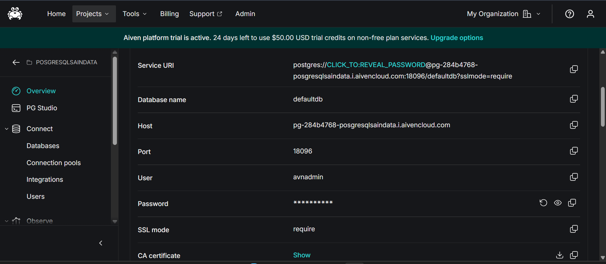
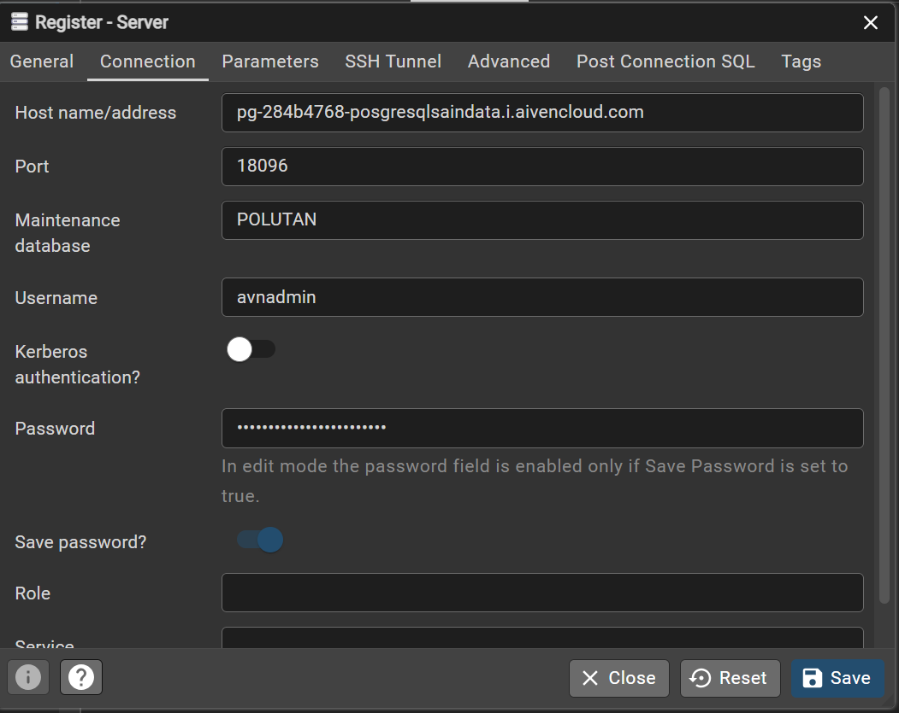
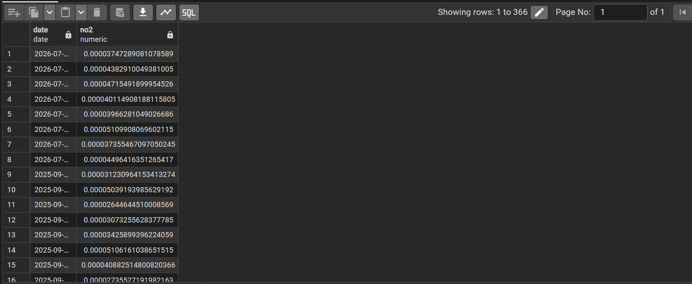
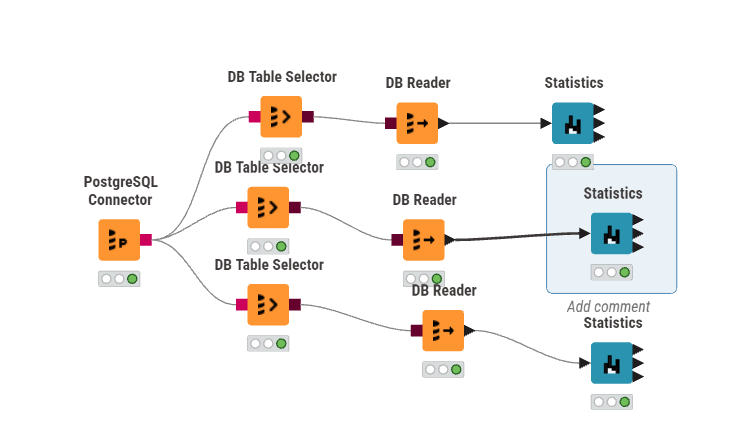
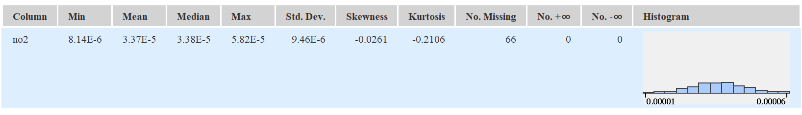

---
jupytext:
  formats: md:myst
  text_representation:
    extension: .md
    format_name: myst
    format_version: 0.13
    jupytext_version: 1.11.5
kernelspec:
  display_name: Python 3
  language: python
  name: python3
---

# Laporan Analisis Statistika Deskriptif Polutan Udara (NO2)

## Bagian 1: Penjelasan Metrik Statistika Deskriptif

Dalam analisis data, ringkasan metrik yang disajikan dalam bentuk tabel disebut sebagai **Statistika Deskriptif (Descriptive Statistics)**. Ringkasan ini umumnya dimanfaatkan pada tahap awal analisis, yakni **Exploratory Data Analysis (EDA)**. Tujuannya adalah untuk memahami karakteristik, pola distribusi, serta kualitas data sebelum beralih ke tahap pemrosesan lanjutan, peramalan (*forecasting*), maupun pemodelan.

Tabel ringkasan menyajikan metrik untuk variabel konsentrasi polutan udara, khususnya Nitrogen Dioksida ($NO_2$). Berikut merupakan penjelasan untuk masing-masing metrik beserta metode perhitungan manualnya:

### 1. Min & Max
*   **Penjelasan:** Merupakan nilai observasi terendah (Min) dan tertinggi (Max) dalam suatu kumpulan data. Metrik ini berguna untuk mengidentifikasi batas bawah dan batas atas dari rentang data.
*   **Perhitungan Manual:** Urutkan seluruh data mulai dari nilai yang terkecil hingga yang terbesar.
    *   $Min = X_1$ (Data pada urutan pertama)
    *   $Max = X_n$ (Data pada urutan terakhir)

### 2. Mean
*   **Penjelasan:** Merupakan nilai pusat (rata-rata) dari sekumpulan data. Nilai ini diperoleh dengan menjumlahkan seluruh observasi, kemudian membaginya dengan total jumlah observasi yang valid.
*   **Perhitungan Manual:**
    $ \bar{x} = \frac{\sum_{i=1}^{n} x_i}{n} $

### 3. Std. Deviation (Standar Deviasi)
*   **Penjelasan:** Mengukur sejauh mana rata-rata simpangan titik-titik data terhadap nilai Mean-nya. Standar deviasi yang rendah mengindikasikan bahwa data cenderung mengelompok di sekitar rata-rata (konsisten), sementara nilai yang tinggi menunjukkan adanya rentang fluktuasi yang lebar.
*   **Perhitungan Manual (Sampel):**
    $ s = \sqrt{\frac{\sum_{i=1}^{n} (x_i - \bar{x})^2}{n-1}} $

### 4. Variance (Varians)
*   **Penjelasan:** Merupakan rata-rata dari kuadrat selisih antara setiap titik data dengan nilai Mean. Secara matematis, varians adalah nilai kuadrat dari Standar Deviasi.
*   **Perhitungan Manual (Sampel):**
    $ s^2 = \frac{\sum_{i=1}^{n} (x_i - \bar{x})^2}{n-1} $

### 5. Skewness 
*   **Penjelasan:** Mengukur tingkat asimetri (ketidakseimbangan) distribusi data terhadap nilai rata-ratanya.
    *   *Skewness = 0*: Data terdistribusi secara simetris (normal) dan berpusat di tengah.
    *   *Skewness > 0 (Positif)*: Ekor distribusi memanjang ke arah kanan.
    *   *Skewness < 0 (Negatif)*: Ekor distribusi memanjang ke arah kiri.
*   **Perhitungan Manual (Fisher-Pearson):**
    $ Skewness = \frac{n}{(n-1)(n-2)} \sum_{i=1}^{n} \left(\frac{x_i - \bar{x}}{s}\right)^3 $

### 6. Kurtosis
*   **Penjelasan:** Mengukur tingkat keruncingan atau bobot ekor (*tailedness*) dari suatu distribusi data. Metrik ini menunjukkan seberapa ekstrem *outlier* (pencilan) yang ada di dalam data.
    *   *Kurtosis \approx 0*: Distribusi normal (Mesokurtik).
    *   *Kurtosis > 0*: Memiliki puncak yang tajam dengan ekor yang tebal (Leptokurtik).
    *   *Kurtosis < 0*: Puncaknya cenderung lebih datar dibandingkan distribusi normal (Platikurtik).
*   **Perhitungan Manual (Excess Kurtosis Sampel):**
    $ Kurtosis = \left[ \frac{n(n+1)}{(n-1)(n-2)(n-3)} \sum \left(\frac{x_i - \bar{x}}{s}\right)^4 \right] - \frac{3(n-1)^2}{(n-2)(n-3)} $

### 7. Overall Sum
*   **Penjelasan:** Merupakan jumlah total dari keseluruhan nilai pada variabel yang bersangkutan.
*   **Perhitungan Manual:**
    $ Sum = \sum_{i=1}^{n} x_i $

### 8. Metrik Kualitas / Anomali Data
*   **No. missings:** Menunjukkan jumlah sel yang kosong (NULL / NA) akibat data tidak berhasil terekam.
*   **No. NaNs (Not a Number):** Menunjukkan jumlah entri yang nilainya tidak terdefinisi secara matematis.
*   **No. +infs / No. -infs:** Menunjukkan adanya nilai batas tak terhingga.
*   **Perhitungan Manual:** Menghitung frekuensi kemunculan baris yang memuat nilai-nilai khusus tersebut.

### 9. Median
*   **Penjelasan:** Merupakan nilai yang persis berada di tengah kumpulan data setelah diurutkan. Median tidak rentan terhadap pengaruh nilai *outlier* yang ekstrem.
*   **Perhitungan Manual:** Urutkan seluruh data mulai dari $X_1$ hingga $X_n$.
    *   Bila $n$ ganjil: $Median = X_{(n+1)/2}$
    *   Bila $n$ genap: $Median = \frac{X_{n/2} + X_{(n/2)+1}}{2}$

---

## Bagian 2: Implementasi Analisis Data Polutan (Dari Cloud Database ke KNIME)

Panduan ini menguraikan tahapan-tahapan untuk menghubungkan database PostgreSQL di platform Aiven, melakukan inspeksi data, serta mengekstraksi metrik statistika deskriptif memanfaatkan KNIME Analytics Platform.

### Langkah 1: Memperoleh Kredensial Database dari Aiven
1. Akses *dashboard* atau console **Aiven**, lalu arahkan ke proyek yang dimiliki.
2. Buka tab **Overview** pada layanan PostgreSQL yang sedang beroperasi (`pg-c4fbe52`).
3. Pada bagian **Connection information**, catat parameter berikut:
   * **Host:** `pg-284b4768-posgresqlsaindata.i.aivencloud.com`
   * **Port:** `18096`
   * **User:** `avnadmin`
   * **Password:** (Salin kata sandi rahasia)
   * **SSL mode:** `require`

### Langkah 2: Mengonfigurasi Koneksi di pgAdmin 4
1. Buka aplikasi **pgAdmin 4**. Pada panel kiri, klik kanan pada **Servers** > **Register** > **Server...**
2. Pada tab **General**, isikan nama koneksi (contoh: `Aiven PSD`).
3. Beralih ke tab **Connection**, isikan Host, Port, Maintenance database (`PSD_Polutan`), Username, dan Password.
4. Klik **Save** untuk menyimpan konfigurasi.

### Langkah 3: Melakukan Inspeksi Tabel Data di pgAdmin 4
1. Navigasikan *tree* server menuju Databases > `POLUTAN` > Schemas > `public` > Tables > `NO2`.
2. Klik kanan pada tabel `NO2`, pilih **View/Edit Data** > **All Rows**.
3. Pastikan kolom data *time-series* (`date`,`no2`) ditampilkan dengan tepat. Nilai `[null]` wajar ditemukan dan akan diproses sebagai *missing values*.

### Langkah 4: Menyusun Alur Kerja (Workflow) di KNIME
1. Jalankan **KNIME Analytics Platform** lalu buat *workflow* baru.
2. Tarik *node* berikut ke *workspace*: **PostgreSQL Connector**, **DB Table Selector**, **DB Reader**, dan **Statistics**.
3. Hubungkan setiap *node* secara berurutan.
4. Konfigurasi **PostgreSQL Connector** dengan kredensial database Anda, lalu atur **DB Table Selector** untuk memilih tabel `NO2` (fokus pada kolom `no2`).
5. Jalankan (*Execute*) hingga lampu indikator berwarna hijau.

### Langkah 5: Membaca Output Statistika Deskriptif
1. Klik kanan pada node **Statistics** kemudian pilih **Execute**.
2. Klik kanan kembali lalu pilih **Statistics View**.
3. Tabel metrik statistik akan ditampilkan, memuat informasi Min, Max, Mean, Std. Deviation, Variance, Skewness, Kurtosis, Missing Values, dan visualisasi Histogram khusus untuk $NO_2$.

---

## Bagian 3: Perhitungan Manual Berdasarkan Dataset Aktual ($NO_2$)

Berikut adalah penjabaran langkah-langkah perhitungan manual menggunakan rumus matematis yang didasarkan pada dataset mentah asli (`NO2_Timeseries.csv`).

Diketahui total baris observasi adalah 366. Karena terdapat 66 data kosong, maka jumlah data valid ($n$) adalah **300**, dengan rata-rata ($\bar{x}$) **0.000033686**.

**1. Standar Deviasi ($s$)**

$$
s = \sqrt{\frac{\sum_{i=1}^{n} (x_i - \bar{x})^2}{n-1}} = \sqrt{\frac{0.00000002673}{300-1}} = \mathbf{0.000009455} \text{ (atau } 9.46 \times 10^{-6})

$$

**2. Variansi ($v$)**

$$
v = s^2 = (0.000009455)^2 = \mathbf{8.94013 \times 10^{-11}}

$$

**3. Skewness**

$$ 
Skewness = \underbrace{\frac{n}{(n-1)(n-2)}}_{A} \underbrace{\sum_{i=1}^{n}\left(\frac{x_i-\bar{x}}{s}\right)^3}_{B}

$$
*   $A = \frac{300}{(299)(298)} = 0.003367$
*   $B = \sum_{i=1}^{300}\left(\frac{x_i - 0.00003369}{0.000009455}\right)^3 = -7.762158$
*   $Skewness = 0.003367 \times (-7.762158) = \mathbf{-0.02613}$

**4. Kurtosis**

$$
Kurtosis = \left[ \underbrace{\frac{n(n+1)}{(n-1)(n-2)(n-3)}}_{A} \underbrace{\sum_{i=1}^{n} \left(\frac{x_i - \bar{x}}{s}\right)^4}_{B} \right] - \underbrace{\frac{3(n-1)^2}{(n-2)(n-3)}}_{C}

$$
*   $A = \frac{300(301)}{(299)(298)(297)} = 0.003412$
*   $B = \sum_{i=1}^{300}\left(\frac{x_i - 0.00003369}{0.000009455}\right)^4 = 826.3628$
*   $C = \frac{3(299)^2}{(298)(297)} = 3.030337$
*   $Kurtosis = (0.003412 \times 826.3628) - 3.030337 = 2.819776 - 3.030337 = \mathbf{-0.2106}$

**5. Overall Sum ($OS$)**

$$
OS = \sum_{i=1}^{n}x_i = 0.00003747 + 0.00004383 + \ldots + x_n = \mathbf{0.01010585}

$$
